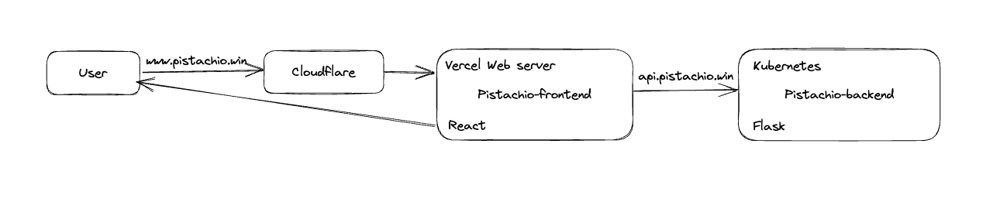

# Pistachio

A file-oriented sharing platform.

## Architecture

When user opens `(www.)pistachio.win`, request will be directed to the frontend app on Vercel after DNS resolution by Cloudflare.

The frontend app fetches data via `api.pistachio.win`, of which the queries are rewritten to the backend deployed on a Kubernetes cluster.

### DNS resolution

The domain pistachio.win was purchased and managed on Cloudflare.

To leverage on the performance optimization of Vercel network infrastructure, DNS queries will be directed to Vercel as follows:

- `www.pistachio.win` works as primary domain, and set to `cname.vercel-dns.com` with a CNAME record.
- `pistachio.win` is resolved to Vercel's own IP 76.76.21.21, then redirected to `www.pistachio.win`.

There's also `api.pistachio.win` for backend API request, which is pointed to the Flask service on Kubernetes.
