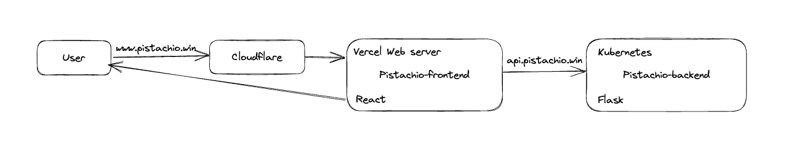

# Pistachio

Pistachio aims to be a PDF-based social app.

Unlike normal posts with photos, videos or even plain texts, PDF is elegant and formal which makes it the perfect fit for meaningful and knowledge-oriented content sharing.

## Features

- Jwt-based authentication & GitHub login support.
- Integrated PDF viewer with support of zooming, searching, etc.
- Responsive design as well as Light&dark color themes.
- Access to summary of the file content via ChatGPT.
- More are on the way.
  - Chat based on selected file like ChatPDF.
  - Search posts by the uploaded file content.

Check out some screenshots of Pistachio in [here](/docs/showcase).

## Usage

The whole application is dockerized and you can simply try it out with docker-compose:

```bash
# Clone the repo
git clone https://github.com/iamgodot/pistachio.git

# Make sure you have docker and start the app
docker-compose up
```

Now open http://localhost:8000 in your browser and the login page should be present.

Note:

1. You need to provide a personal token for GitHub OAuth to make GitHub login work.
2. A ChatPDF API key is required to enable the summary function.

## Breakdown

### Backend

This repo contains only the backend of Pistachio which is based on Flask and MySQL. I also leverage on SQLAlchemy as orm and APIFairy with Flask-Marshmallow for API serialization & param validation & documentation.

The code is well tested with Pytest. Additionally, GitHub Action is used for CI/CD of the development process.

### Frontend

[Pistachio-ui](https://github.com/iamgodot/pistachio-ui) is the repo for frontend code. It's essentially a React app set up with Vite.

For UI design & styling, I build upon this great template project: [TailAdmin](https://github.com/TailAdmin/free-react-tailwind-admin-dashboard).

I use [React PDF Viewer](https://react-pdf-viewer.dev/) for sophisticated PDF viewing and [Tailwindcss](https://tailwindcss.com/) for better css customizing.

## Architecture for Production

This was a live demo before but not anymore, since Pistachio is still in development phase.



When user opens `(www.)pistachio.win`, request will be directed to the frontend app on Vercel after DNS resolution by Cloudflare.

The frontend app fetches data via `api.pistachio.win`, of which the queries are rewritten to the backend deployed on a Kubernetes cluster.

### DNS resolution

The domain pistachio.win was purchased and managed on Cloudflare.

To leverage on the performance optimization of Vercel network infrastructure, DNS queries will be directed to Vercel as follows:

- `www.pistachio.win` works as primary domain, and set to `cname.vercel-dns.com` with a CNAME record.
- `pistachio.win` is resolved to Vercel's own IP 76.76.21.21, then redirected to `www.pistachio.win`.

There's also `api.pistachio.win` for backend API request, which is pointed to the Flask service on Kubernetes.
